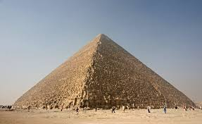

<h1>Seven Wonders Of The World</h1>

The historian Herodotus (484 – c. 425 BC) and the scholar Callimachus of Cyrene (c. 305–240 BC), at the Museum of Alexandria, made early lists of seven wonders. Their writings have not survived, except as references.

The classic seven wonders were:
<ul>
  <li>Great Pyramid of Giza, El Giza, Egypt the only one that still exists.
  <li>Colossus of Rhodes, in Rhodes, on the Greek island of the same name.
  <li>Hanging Gardens of Babylon, in Babylon, near present-day Hillah, Babil province, in Iraq.
  <li>Lighthouse of Alexandria, in Alexandria, Egypt.
  <li>Mausoleum at Halicarnassus, in Halicarnassus, Achaemenid Empire, modern day Turkey.
  <li>Statue of Zeus at Olympia, in Olympia, Greece.
  <li>Taj Mahal on the south bank of the Yamuna river in the India city of Agra.
    </ul>
<ol>
  <li><h3>Great Pyramid of Giza</h3>
                                                                     
    
 Great Pyramid of Giza (also known as the Pyramid of Khufu or the Pyramid of Cheops) is the oldest and largest of the three pyramids in the Giza pyramid complex bordering present-day El Giza, Egypt. It is the oldest of the Seven Wonders of the Ancient World, and the only one to remain largely intact.
Based on a mark in an interior chamber naming the work gang and a reference to the Fourth Dynasty Egyptian pharaoh Khufu, some Egyptologists believe that the pyramid was thus built as a tomb over a 10- to 20-year period concluding around 2560 BC. Initially standing at 146.5 metres (481 feet), the Great Pyramid was the tallest man-made structure in the world for more than 3,800 years until Lincoln Cathedral was finished in 1311 AD. Originally, the Great Pyramid was covered by limestone casing stones that formed a smooth outer surface; what is seen today is the underlying core structure. Some of the casing stones that once covered the structure can still be seen around the base. There have been varying scientific and alternative theories about the Great Pyramid's construction techniques. Most accepted construction hypotheses are based on the idea that it was built by moving huge stones from a quarry and dragging and lifting them into place.
</li>
