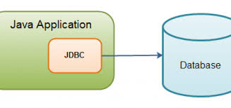

<h1><b>JDBC Connection</b></h1>

JDBC is an acronym for Java Database Connectivity. It’s an advancement for ODBC ( Open Database Connectivity ). JDBC is an standard API specification developed in order to move data from frontend to backend. This API consists of classes and interfaces written in Java. It basically acts as an interface  or channel between your Java program and databases i.e it establishes a link between the two so that a programmer could send data from Java code and store it in the database for future use.

<h2>Testing the availability of database</h2>
 connect to MySQL server and type “show databases;” to see databases list. Then type “use test;” to select test database. And type “show tables;” to list down all the tables available in test database.

<h2>Steps to connect to database</h2>
<ul>
 <li>Import JDBC packages.</li>
<li>Load and register the JDBC driver.</li>
<li>Open a connection to the database.</li>
<li>Create a statement object to perform a query.</li>
<li>Execute the statement object and return a query resultset.</li>
<li>Process the resultset.</li>
<li>Close the resultset and statement objects.</li>
 <li>Close the connection.</li></ul>

<a href="https://www.google.com/imgres?imgurl=https%3A%2F%2Fwww.ntu.edu.sg%2Fhome%2Fehchua%2Fprogramming%2Fjava%2Fimages%2FJDBC_Cycle.png&imgrefurl=https%3A%2F%2Fwww.ntu.edu.sg%2Fhome%2Fehchua%2Fprogramming%2Fjava%2FJDBC_Basic.html&docid=xFLvv1MsuB7B3M&tbnid=ffJgE1VO_9q2dM%3A&vet=10ahUKEwiF_4TP5qDkAhUPiqwKHSKvCHsQMwhPKAwwDA..i&w=792&h=315&bih=625&biw=1366&q=jdbc%20connection%20steps%20in%20cmd%20image&ved=0ahUKEwiF_4TP5qDkAhUPiqwKHSKvCHsQMwhPKAwwDA&iact=mrc&uact=8">(Image Credit)</a>
<ol>
<li><h3>Loading the Driver</h3>

To begin with, you first need load the driver or register it before using it in the program . Registration is to be done once in your program. You can register a driver in one of two ways mentioned below :

Class.forName() : Here we load the driver’s class file into memory at the runtime. No need of using new or creation of object .The following example uses Class.forName() to load the Oracle driver –

 Class.forName(“oracle.jdbc.driver.OracleDriver”);
 DriverManager.registerDriver(): DriverManager is a Java inbuilt class with a static member register. Here we call the constructor of the driver class at compile time . The following example uses DriverManager.registerDriver()to register the Oracle driver –
 DriverManager.registerDriver(new oracle.jdbc.driver.OracleDriver())

 <li><h3>Create the connections</h3>

After loading the driver, establish connections using :

 Connection con = DriverManager.getConnection(url,user,password)
user – username from which your sql command prompt can be accessed.
password – password from which your sql command prompt can be accessed.

con: is a reference to Connection interface.
url : Uniform Resource Locator. It can be created as follows:

String url = “ jdbc:oracle:thin:@localhost:1521:xe”
Where oracle is the database used, thin is the driver used , @localhost is the IP Address where database is stored, 1521 is the port number and xe is the service provider. All 3 parameters above are of String type and are to be declared by programmer before calling the function. Use of this can be referred from final code.
</li>
<li><h3>Create a statement</h3>

Once a connection is established you can interact with the database. The JDBCStatement, CallableStatement, and PreparedStatement interfaces define the methods that enable you to send SQL commands and receive data from your database.
Use of JDBC Statement is as follows:

Statement st = con.createStatement();
Here, con is a reference to Connection interface used in previous step .
</li>
<li><h3>Execute the query</h3>

Now comes the most important part i.e executing the query. Query here is an SQL Query . Now we know we can have multiple types of queries. Some of them are as follows:

Query for updating / inserting table in a database.
Query for retrieving data .
The executeQuery() method of Statement interface is used to execute queries of retrieving values from the database. This method returns the object of ResultSet that can be used to get all the records of a table.
The executeUpdate(sql query) method ofStatement interface is used to execute queries of updating/inserting .
</li>
<li><h3>close the connections</h3>

So finally we have sent the data to the specified location and now we are at the verge of completion of our task .
By closing connection, objects of Statement and ResultSet will be closed automatically. The close() method of Connection interface is used to close the connection.
Example :

 con.close();
 
</li>
 
 <h3>References</h3>
 <ul>
  <li>Feel free to connect  me at <a href="https://www.linkedin.com/in/rohan-goud-28b9a9143"> https://www.linkedin.com/in/rohan-goud-28b9a9143</a></li>
  <li>Read more at <a href="https://www.geeksforgeeks.org/establishing-jdbc-connection-in-java/"> JDBC Connection</a></li>
 <li>View images at <a href="http://www.informit.com/articles/article.aspx?p=26251&seqNum=3"> sources </a></li>
